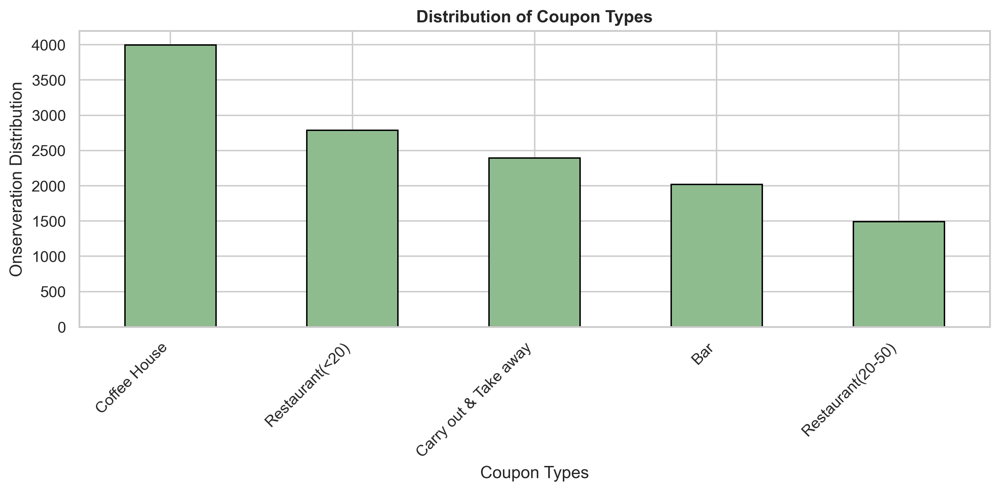
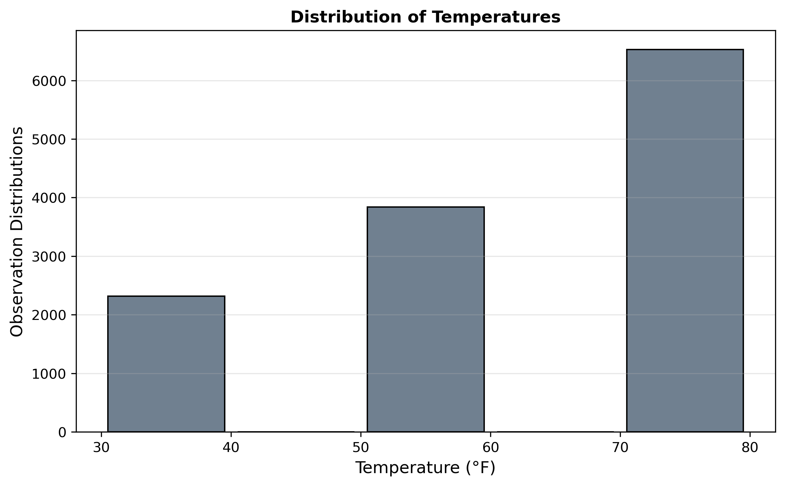
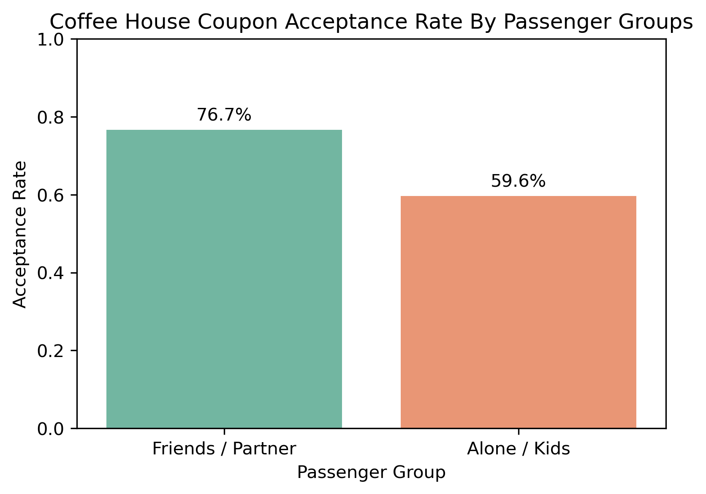
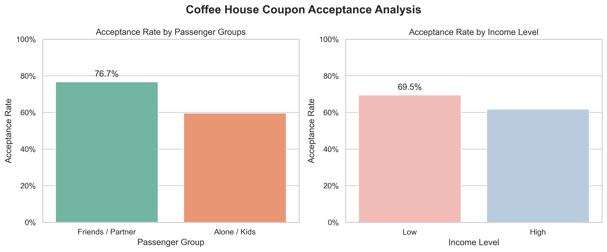

# Assignment 5.1 - Coupon Acceptance Analysis

## Jupyter Notebook
[View the Analysis Notebook](prompt.ipynb)

GitHub Repository: https://github.com/jtie/Module5_Assignment5_1

---

## Problem Statement

This analysis investigates **what factors influence drivers to accept mobile coupons** delivered while they are driving. The study focuses on understanding the characteristics and behaviors of drivers who accept coupons versus those who reject them.

Specifically, this analysis examines two coupon categories:
1. **Bar Coupons**: What driver demographics and behavioral patterns predict acceptance of bar-related offers?
2. **Coffee House Coupons**: How do passenger types influence acceptance of coffee house coupons among regular coffee house visitors?

Understanding these acceptance patterns enables targeted marketing strategies and improved coupon delivery systems that maximize redemption rates.

---

## Data Overview

**Source**: UCI Machine Learning Repository (collected via Amazon Mechanical Turk survey)

**Dataset**: 12,684 driving scenarios with coupon offers

**Key Variables**:
- **User Attributes**: Gender, age, marital status, income, occupation, venue visit frequency (bars, coffee houses, restaurants)
- **Contextual Attributes**: Destination, passenger type, weather, temperature, time of day
- **Coupon Attributes**: Type (Bar, Coffee House, Restaurant <$20, Restaurant $20-50, Carry out), expiration time
- **Outcome**: Acceptance (Y=1) or Rejection (Y=0)

**Overall Acceptance Rate**: 56.84% of all coupons were accepted

### Data Distribution

*Figure 1: Distribution of coupon types in the dataset. Coffee House and Restaurant (<$20) coupons comprise the majority of offers.*

*Figure 2: Distribution of temperatures during coupon delivery scenarios.*

---

## Analysis & Findings

### 1. Bar Coupons Analysis

**Dataset**: 2,017 bar coupon observations (41.00% overall acceptance rate)

#### Key Statistical Findings

**Finding 1: Visit Frequency is the Strongest Predictor**
- **High-frequency bar visitors (>3 times/month)**: 76.88% acceptance rate
- **Low-frequency bar visitors (≤3 times/month)**: 37.07% acceptance rate
- **Difference**: +39.81 percentage points (**statistically significant**)

**Interpretation**: Past behavior is the strongest predictor of coupon acceptance. Drivers who already frequent bars are more than twice as likely to accept bar coupons, demonstrating strong behavioral consistency.

**Finding 2: Age and Social Context Matter**
| Driver Profile | Acceptance Rate |
|----------------|-----------------|
| Visits bars >1/month AND age <30 | 72.17% |
| Visits bars >1/month AND age >25 | 69.52% |
| Visits bars >1/month, no kids, non-farming occupation | 71.32% |
| Visits bars >1/month, no kids, not widowed | 71.32% |
| Frequent cheap restaurant visitors (<$50K income) | 45.76% |

**Interpretation**: Among bar visitors, younger drivers and those in social contexts (no children present, not widowed) show consistently high acceptance rates above 69%. This suggests bar coupon acceptance is associated with a social, leisure-oriented profile rather than family-focused activities.

---

### 2. Coffee House Coupons Analysis

**Dataset**: 3,996 coffee house coupon observations (49.92% overall acceptance rate)

#### Key Statistical Findings

**Finding 1: Passenger Type Dramatically Affects Acceptance**

*Figure 3: Acceptance rates for coffee house coupons by passenger type among regular coffee house visitors.*

| Passenger Type | Acceptance Rate | Difference from Baseline |
|----------------|-----------------|-------------------------|
| Friends / Partner | 76.66% | +26.74 percentage points |
| Alone / Kids | 59.60% | +9.68 percentage points |
| **Overall** | **49.92%** | **(baseline)** |

**Interpretation**: Among drivers who already visit coffee houses regularly (≥1 time/month):
- **Social trips (with friends/partner)** have the highest acceptance at 76.66% — a **28.8% relative increase** over being alone or with kids (59.60%)
- **The gap of 17.06 percentage points** between social and non-social contexts indicates that coffee house coupons resonate most strongly when the driver is already engaged in a social outing
- Even drivers alone or with kids show elevated acceptance (59.60%) compared to the overall rate, suggesting visit frequency still matters

*Figure 4: Detailed breakdown of coffee house coupon acceptance patterns by passenger type and income level.*

---

## Findings Summary

### Bar Coupons: Target Frequent Visitors in Social Contexts

**✅ Key Actionable Insights:**

1. **Primary Target**: Drivers who visit bars >3 times/month show **76.88% acceptance** — nearly double the overall rate
2. **Secondary Target**: Younger drivers (<30 years) visiting bars regularly demonstrate **72.17% acceptance**
3. **Context Matters**: Avoid targeting drivers with children present or those in family-oriented situations — acceptance drops significantly
4. **Cross-venue Opportunity**: Frequent cheap restaurant visitors show moderate acceptance (45.76%), suggesting potential for bundled offers

**⚠️ Avoid**: 
- Drivers who rarely or never visit bars (37.07% acceptance — below overall average)
- Scenarios with children as passengers
- Drivers in farming/forestry occupations with kids present

---

### Coffee House Coupons: Optimize for Social Occasions

**✅ Key Actionable Insights:**

1. **Primary Target**: Regular coffee house visitors (≥1/month) traveling with **friends or partners** show **76.66% acceptance** — the highest-converting segment
2. **Timing Strategy**: Deploy coupons when passenger data indicates social contexts (friends/partner), not solo trips or trips with children
3. **Behavioral Consistency**: Regular coffee house visitors alone/with kids still show strong acceptance (59.60%), indicating visit frequency is foundational
4. **Opportunity Gap**: The 17-point difference between social and non-social contexts represents a significant optimization opportunity through better targeting

**⚠️ Avoid**: 
- Drivers who never visit coffee houses (acceptance likely below 50% baseline)
- Generic broadcasting without passenger context data

---

## Next Steps & Recommendations

### Immediate Actions

1. **Implement Behavioral Segmentation**
   - Build targeting models based on venue visit frequency (primary variable)
   - Create audience segments: "Frequent Bar Visitors" (>3/month) and "Regular Coffee House Visitors" (≥1/month)
   - Deploy coupons preferentially to high-frequency visitors for each venue type

2. **Context-Aware Delivery**
   - Integrate passenger detection (if technically feasible) to optimize coffee house coupon timing
   - Suppress bar coupons when children are passengers
   - Time bar coupon delivery toward younger demographics and evening/social hours

### Future Research Directions

1. **Expand Analysis to Other Coupon Types**
   - Conduct similar investigations for Restaurant (<$20), Restaurant ($20-50), and Carry Out coupons
   - Identify unique acceptance drivers for each category

2. **Temporal and Weather Analysis**
   - Analyze acceptance patterns by time of day, day of week, and weather conditions
   - Determine optimal delivery windows for each coupon type

3. **Income and Occupation Deep-Dive**
   - Explore whether income brackets and occupation types show significant acceptance differences
   - Understand the relationship between financial factors and coupon appeal

4. **Geographic and Distance Factors**
   - Examine how proximity to venue (5min/15min/25min drive) affects acceptance
   - Analyze whether same-direction vs. opposite-direction routing impacts decisions

---

## Data
The analysis is based on the `coupons.csv` dataset located in the `data/` directory.
